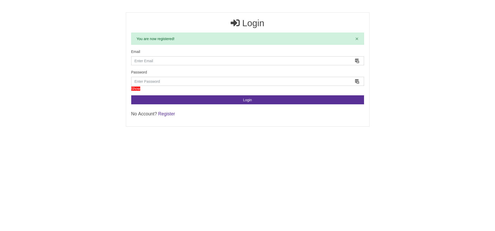
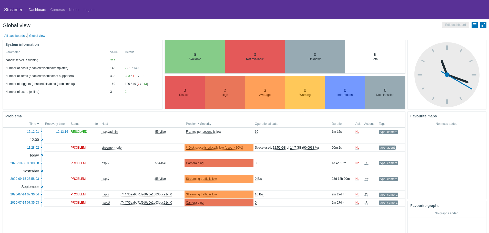
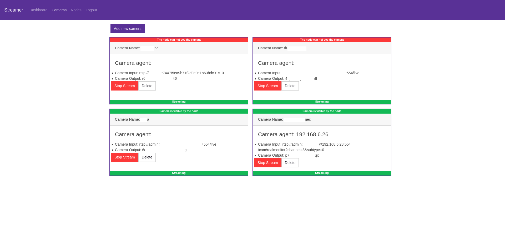
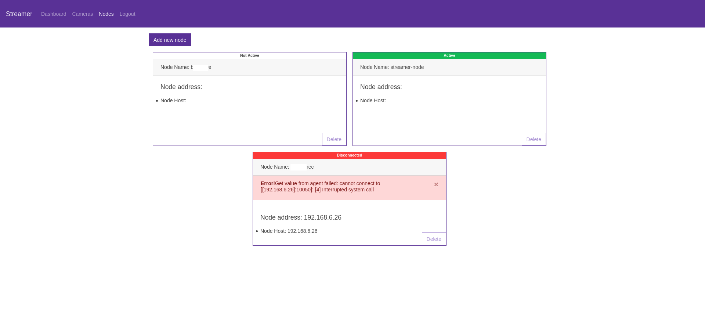

<!-- PROJECT SHIELDS -->
[![Contributors][contributors-shield]][contributors-url]
[![Forks][forks-shield]][forks-url]
[![Stargazers][stars-shield]][stars-url]
[![Issues][issues-shield]][issues-url]
[![MIT License][license-shield]][license-url]
[![LinkedIn][linkedin-shield]][linkedin-url]


<!-- PROJECT LOGO -->
<br />
<p align="center">

  <h3 align="center">Streamer</h3>

  <p align="center">
    Web application to manage and monitor live streaming of
IP cameras to streaming services (YouTube Live,
Facebook), utilizing FFmpeg as a video encoder
    <br />
    <a href="https://github.com/mrhreg/streamer"><strong>Explore the docs »</strong></a>
    <br />
    <br />
    <a href="https://github.com/mrhreg/streamer">View Demo</a>
    ·
    <a href="https://github.com/mrhreg/streamer/issues">Report Bug</a>
    ·
    <a href="https://github.com/mrhreg/streamer/issues">Request Feature</a>
  </p>
</p>


<!-- TABLE OF CONTENTS -->
## Table of Contents

* [About the Project](#about-the-project)
  * [Built With](#built-with)
* [Getting Started](#getting-started)
  * [Prerequisites](#prerequisites)
  * [Installation](#installation)
* [Usage](#usage)
* [Roadmap](#roadmap)
* [Contributing](#contributing)
* [License](#license)
* [Contact](#contact)
* [Acknowledgements](#acknowledgements)


<!-- ABOUT THE PROJECT -->
## About The Project
Screenshots







### Built With

* [NodeJS](https://nodejs.com)
* [Bootstrap](https://getbootstrap.com)
* [Zabbix](https://zabbix.com)
* [nginx](https://nginx.com)
* [docker](https://docker.com)
* [docker-compose](https://docker.com)
* [ffmpeg](https://ffmpeg.com)
* [nmap](https://nmap.com)


<!-- GETTING STARTED -->
## Getting Started

To get a local copy up and running follow these simple steps.

### Prerequisites

This is an example of how to list things you need to use the software and how to install them.
* docker
* docker-compose


### Server Installation

1. Clone the repo
```sh
git clone https://github.com/mrhreg/streamer.git
```
2. Run streamer
```sh
docker-compose -f docker-compose.dev.yml up -d --build
```
### Node installation

1. [Install zabbix agent](https://www.zabbix.com/documentation/3.2/manual/installation/install_from_packages/agent_installation)

2. [install docker](https://docs.docker.com/engine/install/)

3. Configure zabbix agent


<!-- USAGE EXAMPLES -->
## Usage

Open http://localhost:81 and create an account 


_(optional) To access zabbix appliance http://localhost:80_

_default user: Admin default password: zabbix_


_For more examples, please refer to the [Documentation] (comming soon)_


<!-- ROADMAP -->
## Roadmap

See the [open issues](https://github.com/mrhreg/streamer/issues) for a list of proposed features (and known issues).


<!-- CONTRIBUTING -->
## Contributing

Contributions are what make the open source community such an amazing place to be learn, inspire, and create. Any contributions you make are **greatly appreciated**.

1. Fork the Project
2. Create your Feature Branch (`git checkout -b feature/AmazingFeature`)
3. Commit your Changes (`git commit -m 'Add some AmazingFeature'`)
4. Push to the Branch (`git push origin feature/AmazingFeature`)
5. Open a Pull Request


<!-- LICENSE -->
## License

Distributed under the MIT License. See `LICENSE` for more information.


<!-- CONTACT -->
## Contact

Miroslav Hristov - mrhreg@gmail.com

Project Link: [https://github.com/mrhreg/streamer](https://github.com/mrhreg/streamer)


<!-- ACKNOWLEDGEMENTS -->
## Acknowledgements

* []()
* []()
* []()


<!-- MARKDOWN LINKS & IMAGES -->
<!-- https://www.markdownguide.org/basic-syntax/#reference-style-links -->
[contributors-shield]: https://img.shields.io/github/contributors/mrhreg/repo.svg?style=flat-square
[contributors-url]: https://github.com/mrhreg/repo/graphs/contributors
[forks-shield]: https://img.shields.io/github/forks/mrhreg/repo.svg?style=flat-square
[forks-url]: https://github.com/mrhreg/repo/network/members
[stars-shield]: https://img.shields.io/github/stars/mrhreg/repo.svg?style=flat-square
[stars-url]: https://github.com/mrhreg/repo/stargazers
[issues-shield]: https://img.shields.io/github/issues/mrhreg/repo.svg?style=flat-square
[issues-url]: https://github.com/mrhreg/repo/issues
[license-shield]: https://img.shields.io/github/license/mrhreg/repo.svg?style=flat-square
[license-url]: https://github.com/mrhreg/repo/blob/master/LICENSE.txt
[linkedin-shield]: https://img.shields.io/badge/-LinkedIn-black.svg?style=flat-square&logo=linkedin&colorB=555
[linkedin-url]: https://www.linkedin.com/in/miroslav-hristov-47aba384/
[product-screenshot]: screenshots/dashboard.png
